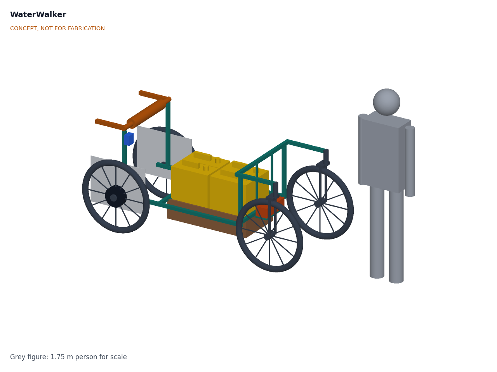
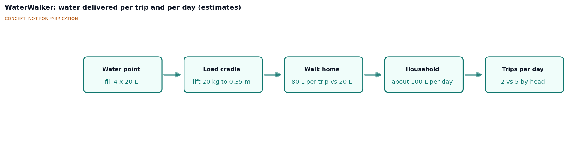
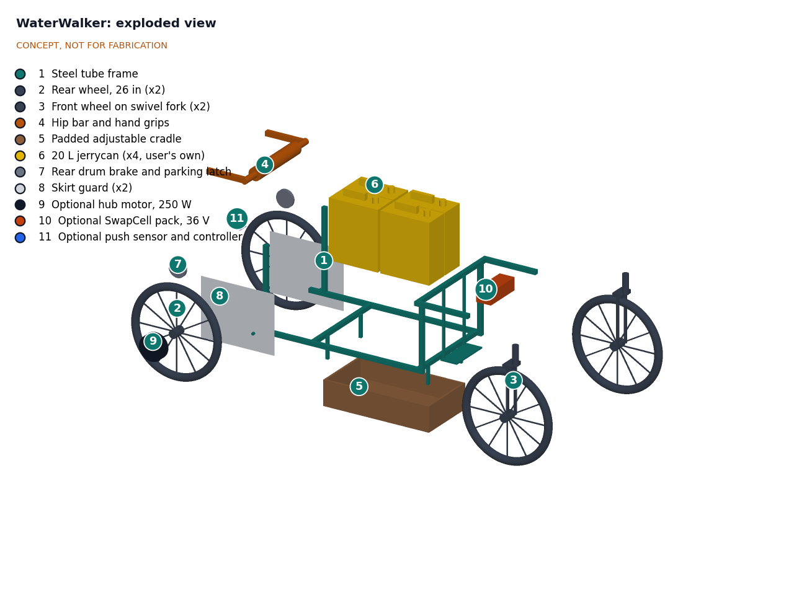

# WaterWalker design precis

WaterWalker is a four-wheel water carrier that the user walks inside and pushes, like a rollator. Four 20 L jerrycans ride low in a padded cradle between the axles, so one trip carries 80 L, four times a head load, with no weight on the head or spine. First-order numbers suggest pushing it on a firm path takes about 25 to 55 N, which is easy, but loose sand takes about 225 to 340 N, which is too much for sustained walking. Sand is therefore the central design problem, and the optional hub motor assist only partly solves it. The unassisted carrier is estimated at about $300 in parts, within the $450 budget. All numbers are desk estimates that co-design with the intended users must test (WWK-PRB-001).

## How it works

1. **Walk in.** The frame is open at the rear. The user steps in between the rear wheels with no step-over and stands behind a padded hip bar, with a hand grip on each side, as in a rollator. Skirt guards cover the inner face of both rear wheels.
2. **Load.** Four 20 L jerrycans (or two clay pots) are lifted from the side into a low padded cradle between the rear wheels and the front wheels. The heaviest lift is about 350 mm off the ground, below knee height, instead of above the head.
3. **Push.** The user walks normally and pushes through the hip bar and grips. There is no pedalling, balancing or treadmill, so it works on slopes, in long skirts and for any walking user.
4. **Steer.** The rear wheels are fixed. The front wheels are on full-swivel caster forks, so the carrier follows the hip bar and turns about the user. The casters can be pinned straight for sand, cross-slopes and descents.
5. **Brake and park.** Drum brakes in both rear hubs are worked from a lever on a grip, which has a latch for parking.
6. **Assist (optional).** A 250 W hub motor in one rear wheel, powered by a removable SwapCell pack, adds thrust only while a sensor in the hip bar mount feels the user pushing, so the carrier never moves on its own.

## Main components

| # | Component | Proposed choice | Notes |
| --- | --- | --- | --- |
| 1 | Frame | Mild steel square tube, 25 x 25 x 1.5 mm, welded; two side rails at axle height, cradle cross members, front risers and caster arms, hip bar uprights | Open rear for walk-in entry; repairable by a local welder |
| 2 | Rear wheels (2) | 26 x 2.1 to 2.4 in bicycle wheels with drum-brake hubs, thorn-resistant tubes and tire liners | Fixed on stub axles outboard of the side rails. Size proposed, awaiting Amish |
| 3 | Front wheels (2) | 26 in wheels on rigid bicycle forks turned into caster forks, 60 mm trail, standard headset bearings, drop-pin swivel lock | Full swivel; arms pass above the tires. Proposed, awaiting Amish |
| 4 | Hip bar and hand grips | Padded steel bar on telescopic posts, 850 to 1,050 mm height, rear-facing bicycle grips | Push through the hips as well as the hands |
| 5 | Cradle | Plywood or steel-mesh tray, about 780 x 430 mm, 20 mm rubber pad from recycled tire, low walls, adjustable straps and removable dividers | Holds four jerrycans 2 x 2, or two clay pots in line |
| 6 | Containers | The user's own 20 L jerrycans (four) | Shown for scale; not purchased |
| 7 | Brakes | Drum brakes in both rear hubs, lever on a grip with a parking latch | Sealed drums tolerate sand better than rim brakes |
| 8 | Skirt guards (2) | HDPE sheet panels on the inside of the rear wheels | Keep skirts, wraps and hands out of the spokes |
| 9 | Hub motor (optional) | 250 W geared rear hub motor, 26 in, with controller | Proposed not in the first prototype, awaiting Amish |
| 10 | Battery (optional) | SwapCell 36 V removable pack | Shared standard with the SwapCell project |
| 11 | Push sensor and controller (optional) | Load cell in the hip bar mount, amplifier and microcontroller | Motor runs only while the user pushes |

## First-order numbers

All values are estimates for concept review and will be checked at TRL 3.

Assumptions: 80 kg of water in four 1.1 kg jerrycans; carrier empty mass about 31 kg without assist (frame 11 kg, wheels and forks 13 kg, cradle 3.5 kg, hip bar 1.5 kg, brakes and guards 2 kg) and about 38 kg with assist; loaded mass about 115 kg (122 kg with assist); g = 9.81 m/s²; rolling resistance coefficient 0.02 to 0.05 on firm dirt paths and 0.2 to 0.3 on loose sand for 26 in wheels with wide tires; assist thrust about 120 N (about 40 N·m from a geared hub motor at a 0.33 m wheel radius); walking speed about 1.0 m/s on firm ground and 0.6 m/s on sand.

| Quantity | Estimate | Basis | Requirement |
| --- | --- | --- | --- |
| Water per trip | 80 L | Four 20 L jerrycans | R1 met for jerrycans; four 20 L clay pots do not fit (two do) |
| Push force, firm level path | about 25 to 55 N | 0.02 to 0.05 x 1,128 N | R2 (60 N) met, thin margin at the rough end |
| Human power, firm path | about 25 to 55 W | Push force x 1.0 m/s | Comparable to brisk walking |
| Push force, loose sand, unassisted | about 225 to 340 N | 0.2 to 0.3 x 1,128 N | R3 (150 N) **not met** |
| Push force, loose sand, with assist | about 120 to 240 N | 0.2 to 0.3 x 1,197 N, less 120 N assist | R3 met only on firmer sand |
| Push force, 10 % climb, firm, unassisted | about 135 to 170 N | Grade force 1,128 N x 0.0995 = 112 N, plus rolling | R4 (180 N) met, thin margin |
| Push force, 10 % climb, with assist | about 25 to 60 N | 119 N grade plus rolling, less 120 N | R4 met |
| Hold-back force, 10 % descent | about 55 to 90 N | Grade force less rolling resistance | Service brake needed on long descents (R4, R10) |
| Parking brake holding force, 20 % grade | about 250 N at the tires | 128 kg gross with assist x 9.81 x 0.196 | R10, brake to be sized at TRL 3 |
| Turning circle | about 3.8 m diameter | Turns about the rear axle centre; outer front tire at about 1.9 m radius | R5 (4.0 m) met, thin margin |
| Overall size | about 860 mm wide, 2.2 m long | Massing model | R6 (900 mm) met |
| Rear entry step-over, walking width | 0 mm, about 660 mm clear | Open rear, side rails at 345 mm each side of centre | R7 met |
| Container lift height | about 350 mm | Cradle wall height | R8 (450 mm) met |
| Static side tip angle, loaded | about 45 degrees | Half track 400 mm, centre of mass about 400 mm high | Wide margin on cross-slopes |
| Empty mass | about 31 kg (38 kg with assist) | Roll-up above | R9 (35 kg, 42 kg) met |
| Assist energy | about 70 Wh per km of sand or slope | 120 N x 1 km = 33 Wh at the wheel, about 50 % efficiency at walking speed | A 36 V, 10 Ah pack (assumed) gives about 5 km of assist |
| Parts cost | about $300 without assist, about $600 with assist | Indicative prices, see bom/bom.csv | R11 met without assist, **not met** with assist |

### Comparison with head carrying

For a household of five using about 100 L per day, on a 3 km round trip (estimates):

| | Head carrying | WaterWalker |
| --- | --- | --- |
| Water per trip | 20 L | 80 L |
| Trips per day for 100 L | 5 | 2 (1.25 rounded up) |
| Trips saved per day | | 3 |
| Walking time per day at 4 km/h | about 3.75 h | about 1.5 h, if walking speed is similar |
| Load on head and spine | about 20 kg | none; about 25 to 55 N push on firm ground |

The time saving shrinks on sandy routes, where walking is slower and the push force is high, and it does not include queueing and filling time at the water point, which the carrier does not change.

## Key design choices

Each is proposed, awaiting Amish, and should be tested in co-design.

1. **Wheel size.** Options: 20 in all round (compact and light, worse on sand); 26 in all round; 26 in rear with 20 in front (shorter frame, tighter turn, two tire sizes); 28 in roadster wheels (best on sand, common in East Africa, longer and heavier). Recommendation: **26 x 2.1 to 2.4 in all round**, for sand performance, one spare tire size and wide availability in rural markets.
2. **Assist in the first prototype.** Options: include the hub motor, SwapCell pack and push sensor now (about $600, over budget), or build the unassisted carrier first with mounting points for assist. Recommendation: **no assist in the first prototype**. Use it to learn what users need on their own routes and keep within the $450 budget, then add assist in a second prototype if sand or slopes demand it.
3. **Steering.** Options: full-swivel front casters with a lock (turns in about 3.8 m); fixed front wheels (simple, but must be skidded to turn, the Hippo Roller weakness); limited-swivel casters on a shorter frame (turning circle about 6 m). Recommendation: **full-swivel lockable casters**, which drive the long wheelbase.
4. **User position.** Options: between the rear wheels (modelled); or behind the rear axle, which shortens the frame and tightens the turn to about 2.8 m but puts the rear containers beside the rear wheels where they are hard to load. Recommendation: **between the rear wheels**.
5. **Cradle width and clay pots.** A 430 mm wide cradle takes four jerrycans 2 x 2 but only two 20 L clay pots. Four pots 2 x 2 need about 780 mm, which pushes the overall width to about 1.1 m and breaks R6. Options: accept four jerrycans or two pots per trip; widen the carrier; or lengthen the cradle for four pots in a row. Recommendation: **four jerrycans or two pots**, until co-design shows how often pots are used.
6. **Brake type.** Options: drum brakes with a lever and parking latch; rim brakes (cheaper, but wear fast in sand and fail when wet); a dead-man brake that applies whenever the user lets go of the hip bar (safest against runaway, more parts). Recommendation: **drum brakes with a parking latch**, and ask users about a dead-man brake.

## Safety

> **Safety:** A loaded WaterWalker has a mass of about 115 to 128 kg. On a 10 % slope it pulls downhill with about 55 to 90 N more than rolling resistance absorbs. Rated load and slope limits must be marked on the frame, and the parking brake must hold a full load on the steepest rated slope.

- **Runaway on slopes.** If the user trips or lets go on a descent, the carrier rolls away. Mitigations: service brake on a grip, parking latch, casters pinned straight on descents, and a possible dead-man brake (design choice 6). A wrist tether is an option to test in co-design.
- **Brakes.** Drum brakes must be sized to hold the gross mass on a 20 % grade and to stop from walking speed on a 10 % descent. Sand and water in rim brakes are the main reason for choosing drums.
- **Tipping.** The low cradle gives a static side tip angle of about 45 degrees, but a wheel dropping into a rut or ditch on a cross-slope can still tip the carrier. Containers must be strapped so the load cannot shift. Do not carry children or people in the cradle.
- **Pinch and entanglement points.** Spokes, caster forks and brake levers can catch skirts, wraps, fingers and children's hands. Skirt guards cover the rear wheels. Caster swivel zones must be kept clear of feet and marked, and the hip bar telescopic joints must not pinch.
- **Lifting.** Lifting 20 kg to 350 mm is far safer than lifting to head height, but containers should be filled in place where possible and loaded from the side with a straight back.
- **Lithium battery (assist only).** The SwapCell pack must have a battery management system with cell-level protection and a fuse, be protected from water and sand, be charged on a non-combustible surface away from sleeping areas, and never be charged if damaged or swollen. The motor must run only while the push sensor detects the user pushing, with a hard cut-off when the brake lever is pulled.
- **Single-sided drive (assist only).** A hub motor in one rear wheel pushes the carrier sideways with free casters. Casters should be locked straight while the assist runs, or a second motor added; see open questions.

## Open questions for TRL 3

- Confirm rolling resistance in loose sand for 26 in wheels with 2.1 to 2.4 in tires at this load; wider tires or lower pressure may reduce it enough to change the assist decision.
- Does a single hub motor with free casters steer the carrier? Compare locking casters under assist against two smaller motors.
- Can a geared hub motor deliver about 40 N·m continuously at about 30 rpm (walking speed on a 26 in wheel) without overheating?
- Confirm the frame is stiff enough in torsion with an open rear, and size the tube.
- Size the drum brakes and the parking latch for a 20 % grade.
- Confirm sustained push force limits with the intended users, including girls and older women.
- Decide how often clay pots are used and whether a pot-specific cradle insert is worthwhile.
- Identify the local partner and region for the first co-design sessions (WWK-PRB-001).

Concept media: [blueprint sheet](../media/concept-blueprint.pdf), [interactive 3D model](../media/viewer.html).
