# WaterWalker prototype build plan

**Plan, not yet built.** How to build the first proof-of-concept prototype, component by component. Building and testing to it is TRL 4 work. Decisions still to be made are kept in the design decisions register ([docs/06-design-decisions.md](06-design-decisions.md)), not here.

## 1. What you are building

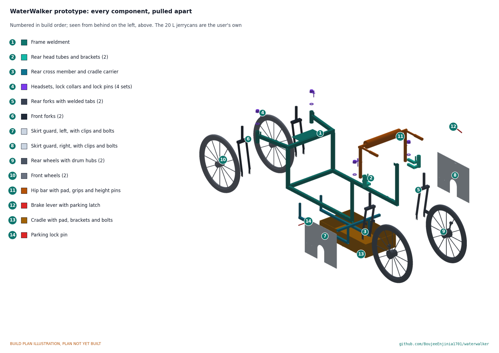

*Figure 1. Every component pulled apart and numbered in build order.*

The prototype is the first WaterWalker without assist: a welded mild steel frame on four 26 in bicycle wheels, open at the rear so the user walks in between the rear wheels and pushes on a padded hip bar, with a plywood cradle between the axles for four 20 L jerrycans. Figure 1 shows the 14 components in the order you make or fit them. Eight are made: the frame weldment, the two rear head tube brackets, the cradle carrier, four lock collars, the tabs welded to the rear forks, two skirt guards, the hip bar and the cradle. The rest are bought bicycle parts and fixings: four rigid forks, four built wheels (drum hubs at the rear), headsets, tires, a brake lever with a parking latch and cables, grips, a hip pad, lock pins and bolts. The work is sawing, drilling, coping and arc welding square and round steel tube, cutting plywood and plastic sheet, and fitting bicycle parts. The parts cost about USD 462 from the bill of materials. The assist mounting points are built in; the assist kit itself is a later prototype.

> **Safety:** Loaded, the carrier weighs about 124 kg and rolls away on a slope if let go. Never load it before the safety stops of section 6 are passed, never leave it loaded on a slope without the parking lock pin in, and never carry a person in the cradle. Welding gives off fumes and ultraviolet light, and hot steel and sharp cut edges burn and cut: weld in a ventilated space with a welding helmet, gloves and cotton clothing, and deburr every cut. Steel fork blades must only be welded by a welder who has done it before, with short welds and no undercut.

## 2. What changed to make it buildable

The concept showed what the carrier does; many of its parts could not be made or fixed as drawn. Each change below keeps what the carrier does, and all of them are recorded in decision record WWK-DDR-003, open for Amish's review.

*Table 1. Changes from the concept.*

| Component | The concept had | The buildable design has | Why |
| --- | --- | --- | --- |
| Side rails | Rails running back through the rear forks to behind the axle | Rails ending at the hip sleeves, 45 mm ahead of the rear axle (Figure 2) | The forks now hold the rear wheels; the rear stays open |
| Rear head tubes | One short bracket per head tube, running into the tube; head tube straight above the axle | Two brackets 60 mm apart per head tube; head tube 60 mm behind the axle, matching the fork's offset (Figures 5 and 6) | Holds the twist from parking on one pinned wheel; any rigid fork fits |
| Cradle support | Hangers standing on the cradle floor, through its end walls; nothing under the floor | Two steel bearers under the floor on four hangers from the cross members (Figures 7 and 8) | The floor rests on steel; the cradle lifts out after four bolts |
| Rear cross member | Through the rear jerrycans | 17.5 mm further back, just behind the cradle | The cans clear it by 8 mm |
| Caster arms | Into the centre of the head tube, on stubs outboard of the risers | Straight from the top of each riser to the side of the head tube, angled 8.6 degrees outward (Figures 2 and 3) | The steerer passes freely; the arm's load goes straight down the riser |
| Forks in the head tubes | Solid head tubes; a lock pin standing in the air | Headsets at all four corners; a lock collar and pin on each fork (Figures 9 and 10) | The forks are held, turn freely at the front and are pinned straight at the rear |
| Hip bar | Posts 280 mm long in solid sleeves; 32 mm grip tubes | 364 mm posts sliding in tube sleeves; 22.2 mm grip tubes (Figures 16 and 17) | 150 mm stays in the sleeve at full height; standard grips and brake lever fit |
| Parking lock pin | Held by one tab only | Held by tabs on both fork blades (Figures 11 and 12) | The pin no longer bends under the parking load |
| Skirt guards | No fixing; a round hub hole | Two bolts to rail tabs, two clips on the fork blade, a slot for the hub (Figures 14 and 15) | Fitted before the wheel; held at four points |
| Brake reaction arm | Ending in the air | Clipped along the outer fork blade (Figure 13) | It must carry the brake torque |
| Cradle | Walls overlapping, no fixings | End walls between the side walls; 14 angle brackets outside (Figures 18 and 19) | 4 mm plywood takes no screws in its edge |

## 3. Making the components

Make and check each component before the assembly step that needs it. Sizes are in millimetres. Heights are above the ground with the carrier on its wheels; "ahead of the rear axle" is measured forward from the rear axle line; "out from the centre line" is measured sideways. "Left" and "right" are as the user sees them, walking in. Workshop tolerance is 1 mm on steel and 2 mm on plywood unless a step says otherwise; drawings do not carry tolerances before TRL 4.

### 3.1 Frame weldment

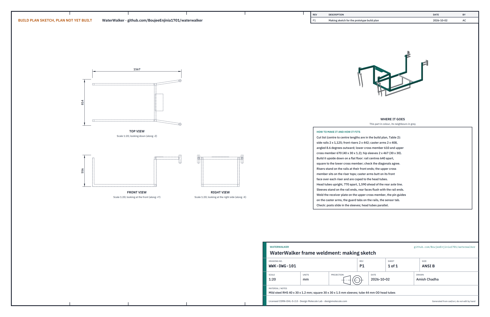

*Figure 2. Frame weldment making sketch (WWK-DWG-101).*

**What it is and what it is made from.** The welded steel ladder that carries everything: two side rails, two front risers, a lower and an upper front cross member, two caster arms, two hip sleeves and the two front head tubes, with small plates and tabs welded on. Mild steel rectangular tube 40 x 30 x 1.2 mm, square tube 30 x 30 x 1.5 mm for the sleeves, and tube 44 mm outside and 34 mm bore for the head tubes.

*Table 2. Cut list for the frame, the rear brackets and the cradle carrier (lengths along the centre line).*

| Piece | Tube | Number | Length | Ends |
| --- | --- | --- | --- | --- |
| Side rail | 40 x 30 x 1.2 | 2 | 1,125 | Square |
| Front riser | 40 x 30 x 1.2 | 2 | 442 | Square |
| Front lower cross member | 40 x 30 x 1.2 | 1 | 610 | Square |
| Upper cross member | 40 x 30 x 1.2 | 1 | 670 | Square |
| Caster arm | 40 x 30 x 1.2 | 2 | 408 | Mitred 8.6 degrees at the root; coped to the 44 mm head tube |
| Hip sleeve | 30 x 30 x 1.5 | 2 | 467 | Square |
| Front head tube | 44 OD, 34 bore | 2 | 140 | Faced square |
| Rear head tube | 44 OD, 34 bore | 2 | 140 | Faced square |
| Rear bracket arm | 25 x 25 x 1.5 | 4 | 117.5 | Square |
| Rear bracket stub | 25 x 25 x 1.5 | 4 | 30.5 | One end coped to the head tube |
| Rear cross member | 25 x 25 x 1.5 | 1 | 610 | Square |
| Cradle bearer | 25 x 25 x 1.5 | 2 | 837.5 | Square |
| Rear hanger | 20 x 20 x 1.5 | 2 | 171 | Square |
| Front hanger | 20 x 20 x 1.5 | 2 | 164 | Square |

**How to make it.**

1. Cut every piece in Table 2 and deburr it. Mark each piece with chalk.
2. Lay the two side rails on a flat floor, 640 apart centre to centre and parallel. Weld the front lower cross member between their front ends, square, its front face flush with the rail ends. Check the diagonals agree within 2 mm.
3. Stand a front riser on the top of each rail at its front end, flush with the rail's end and sides, square both ways. Tack, check, weld.
4. Lay the upper cross member across the riser tops, centred, its ends 15 out past each riser. Weld it on.
5. Jig each front head tube upright, 385 out from the centre line and 1,590 ahead of the rear axle line (440 ahead of the risers' centre), its bottom 730 above the ground (use blocks under the rails at the 313.5 rail bottom height). Fit each caster arm between the front face of the upper cross member over its riser and the side of its head tube; the arm angles 8.6 degrees outward. Cope the head tube end until it sits fully on the tube wall. Weld.
6. Stand a hip sleeve on the top of each rail at its rear end, rear face flush with the rail end, square both ways. Weld only the outside corners first, then check that a hip post slides in; file out any weld that has pulled the bore in.
7. Weld on the small parts: the receiver plate (140 x 300 x 3) on top of the upper cross member, lapping its front face by 15 and centred; a pin guide (14 mm tube, 39 long) upright on each caster arm, 45 back along the arm from the head tube axis, after drilling a 9 mm hole in the arm top under it; two guard tabs (25 x 5 flat bar, 40 long) flat on the outer face of each rail at 150 and 240 ahead of the rear axle line, then drilled 5 and tapped M6 through tab and rail wall; the sensor tab (40 x 30 x 4) standing forward from the right sleeve's front face, 785 to 815 up, with a 6.5 hole.
8. Drill a 6.5 hole front to back through each sleeve, 775 up, for the height pin.
9. Fit plastic end caps in every open tube end.

**How it fits the parts next to it.** The rear head tube brackets weld to the rear faces of the hip sleeves (section 3.2); the cradle carrier hangs from the front lower cross member and the rear cross member (section 3.3); the forks go up through the head tubes (step 2 and 5); the hip posts slide into the sleeves (section 3.7). The joints at the front corner:

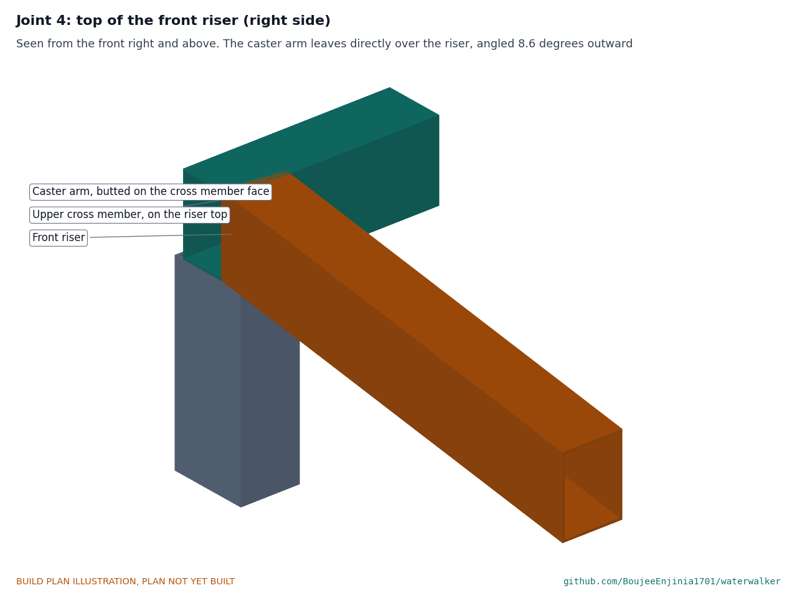

*Figure 3. Joint 4. The upper cross member sits on the riser top; the caster arm butts on the cross member's front face directly over the riser.*

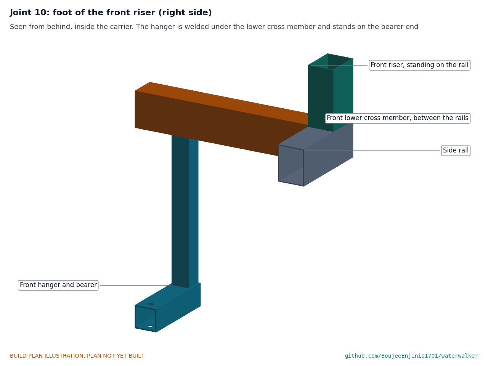

*Figure 4. Joint 10. The riser stands on the rail; the lower cross member fits between the rails.*

**Check before moving on.** The rails are parallel and level; the four head tube positions are within 1 mm; each head tube is upright within 0.5 degree both ways; both hip posts slide in and out of their sleeves by hand.

### 3.2 Rear head tubes and brackets (make 2, mirror images)

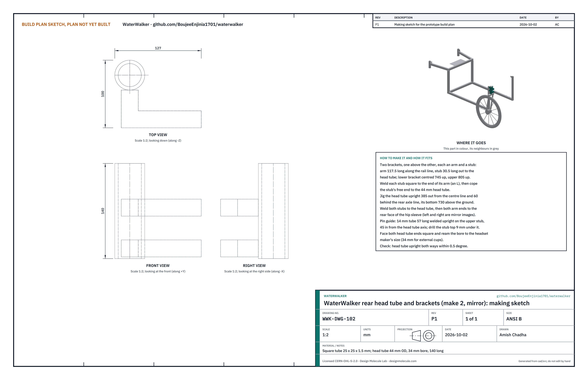

*Figure 5. Rear head tube and brackets making sketch (WWK-DWG-102).*

**What it is and what it is made from.** The head tube that holds each rear fork, carried on two short brackets welded to the back of the hip sleeve. Square tube 25 x 25 x 1.5 mm and the same 44 mm head tube as the front.

**How to make it.**

1. For each bracket, weld a stub square to one end of an arm to make an L, with the stub's free end pointing outward. Cope the stub's free end to fit the 44 mm head tube.
2. Jig the head tube upright, 385 out from the centre line and 60 behind the rear axle line, its bottom 730 above the ground.
3. Offer up the lower bracket (centre 745 up) and the upper bracket (centre 805 up): each arm runs along the rail's centre line to the sleeve's rear face, each stub meets the head tube. Weld the stubs to the head tube, then the arms to the sleeve.
4. Weld a pin guide (14 mm tube, 57 long) upright on top of the upper stub, 45 in from the head tube axis, after drilling a 9 mm hole in the stub top under it.
5. Face both head tube ends square and ream the bore to the headset maker's size.

**How it fits the parts next to it.**

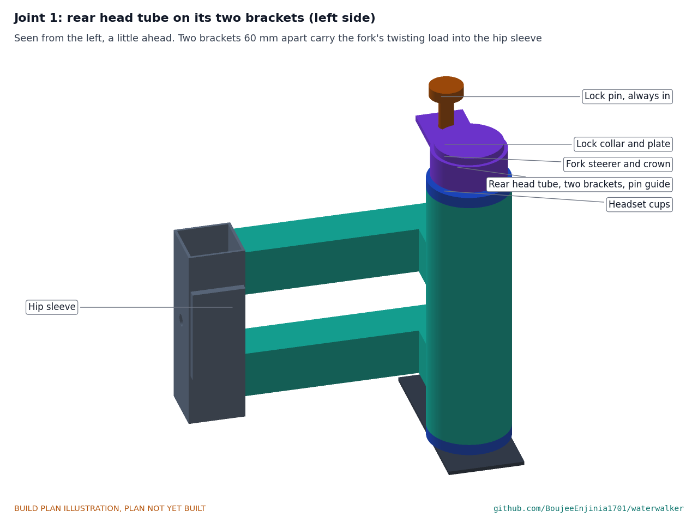

*Figure 6. Joint 1. The two brackets, 60 apart, turn the twist from the fork into push and pull on the sleeve.*

The arms butt on the sleeve's rear face and are welded all round. The stubs are coped to the head tube and welded all round. The fork crown passes 8 mm under the lower bracket.

**Check before moving on.** The head tube is upright both ways within 0.5 degree, 770 from the other rear head tube centre to centre, and lines up with the front head tube on the same side when sighted along the carrier.

### 3.3 Rear cross member and cradle carrier

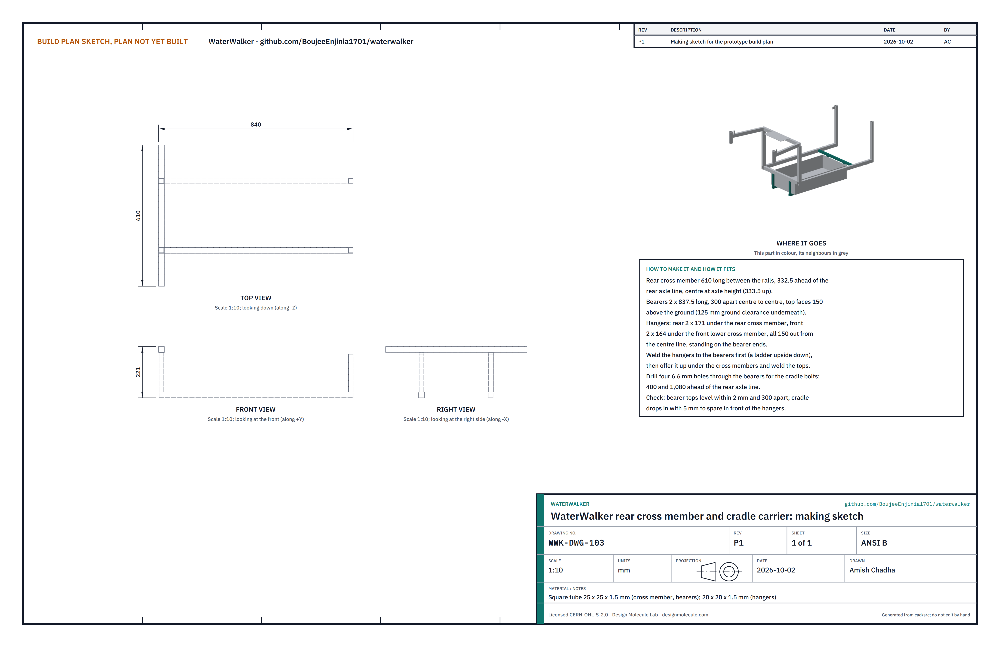

*Figure 7. Rear cross member and cradle carrier making sketch (WWK-DWG-103).*

**What it is and what it is made from.** The rear cross member between the rails, and a ladder under the cradle: two bearers the cradle floor rests on and four hangers that carry them from the cross members. Square tube 25 x 25 x 1.5 mm and 20 x 20 x 1.5 mm.

**How to make it.**

1. Weld the rear cross member between the rails, 332.5 ahead of the rear axle line, centred on the rail height.
2. Weld a rear hanger (171) standing on one end of each bearer, and a front hanger (164) on the other end, flush with the bearer ends. Keep them square.
3. Drill two 6.6 holes through each bearer, top to bottom, 400 and 1,080 ahead of the rear axle line once fitted (77.5 and 757.5 from the bearer's rear end).
4. Turn the frame upside down. Offer each bearer up so its hangers sit under the rear and front lower cross members, 150 out from the centre line. Weld the hanger tops all round.

**How it fits the parts next to it.**

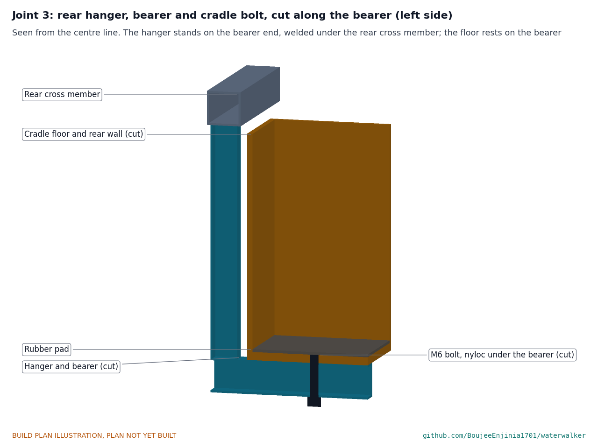

*Figure 8. Joint 3. The hanger stands on the bearer end and is welded under the rear cross member; the cradle floor rests on the bearer and is bolted through it.*

The bearer tops are 150 above the ground; the cradle floor sits on them. The cradle clears the rear hangers by 5 and the front hangers by 10. Ground clearance under the bearers is 125.

**Check before moving on.** Both bearer tops are level within 2 mm and 300 apart; a straight edge across them touches both.

### 3.4 Lock collars (make 4)

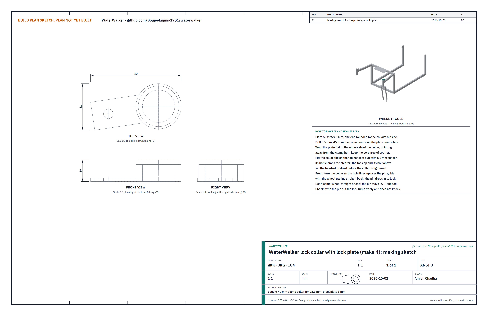

*Figure 9. Lock collar making sketch (WWK-DWG-104).*

**What it is and what it is made from.** A clamp collar on the top of each fork's steerer with a plate that a pin drops through, so the fork can be locked straight. A bought 40 mm clamp collar for a 28.6 mm steerer and 3 mm steel plate.

**How to make it.**

1. Cut four plates 59 x 25 from 3 mm plate; round one end to the collar's outside.
2. Drill an 8.5 hole on the plate's centre line, 45 from the collar centre.
3. Weld each plate flat to the underside of its collar, pointing away from the clamp bolt. Keep spatter out of the bore.

**How it fits the parts next to it.**

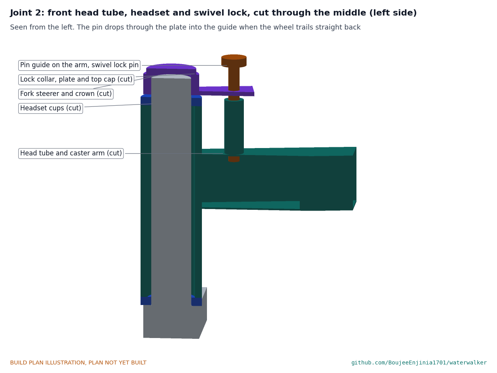

*Figure 10. Joint 2. The collar clamps the steerer 2 mm above the top headset cup; the top cap above it sets the headset preload; the pin drops through the plate into the guide on the caster arm.*

**Check before moving on.** With a collar on a spare steerer, an 8 mm pin passes through the plate hole freely.

### 3.5 Rear forks: welded tabs

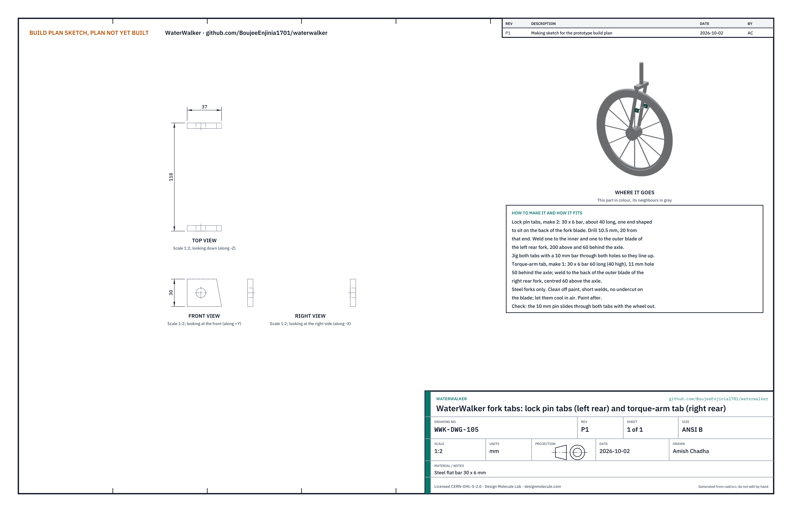

*Figure 11. Fork tabs making sketch (WWK-DWG-105).*

**What it is and what it is made from.** Two tabs on the left rear fork that hold the parking lock pin at both ends, and one tab on the right rear fork for the torque arm of the later hub motor. Steel flat bar 30 x 6 mm, welded to bought steel forks.

**How to make it.**

1. Lock pin tabs: cut two pieces about 40 long. Shape one end of each to sit on the back of the fork blade. Drill 10.5, 20 from that end.
2. Strip the paint from the backs of the left rear fork's blades, 190 to 220 above the axle centre.
3. Put a 10 mm bar through both tabs and hold them on the backs of the inner and outer blades, the holes 200 above and 60 behind the axle centre. Weld with short runs, letting the blade cool between them.
4. Torque-arm tab: cut one piece 66 long, drill 11 at 50 behind the axle once fitted, and weld it to the back of the right rear fork's outer blade, centred 60 above the axle and in the blade's thickness.
5. Paint the bare steel.

**How it fits the parts next to it.**

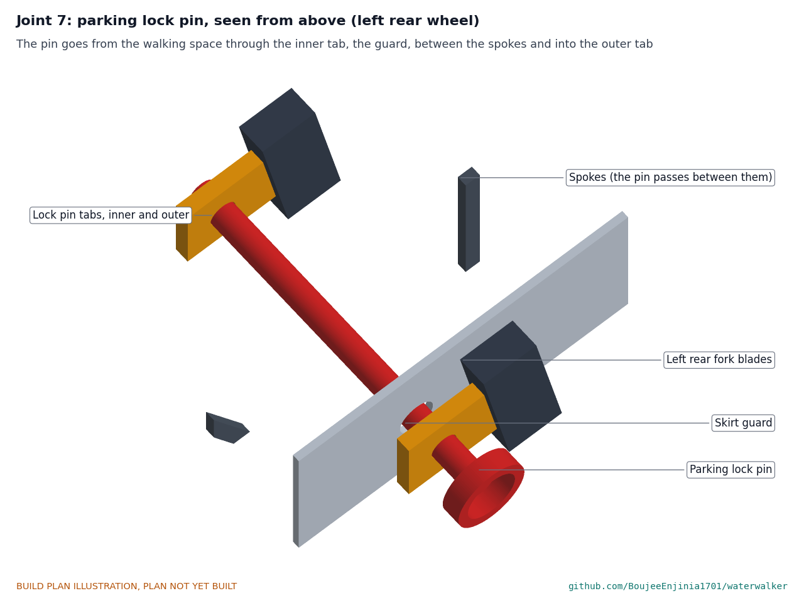

*Figure 12. Joint 7. The pin passes through the inner tab, the skirt guard and the spokes, and into the outer tab.*

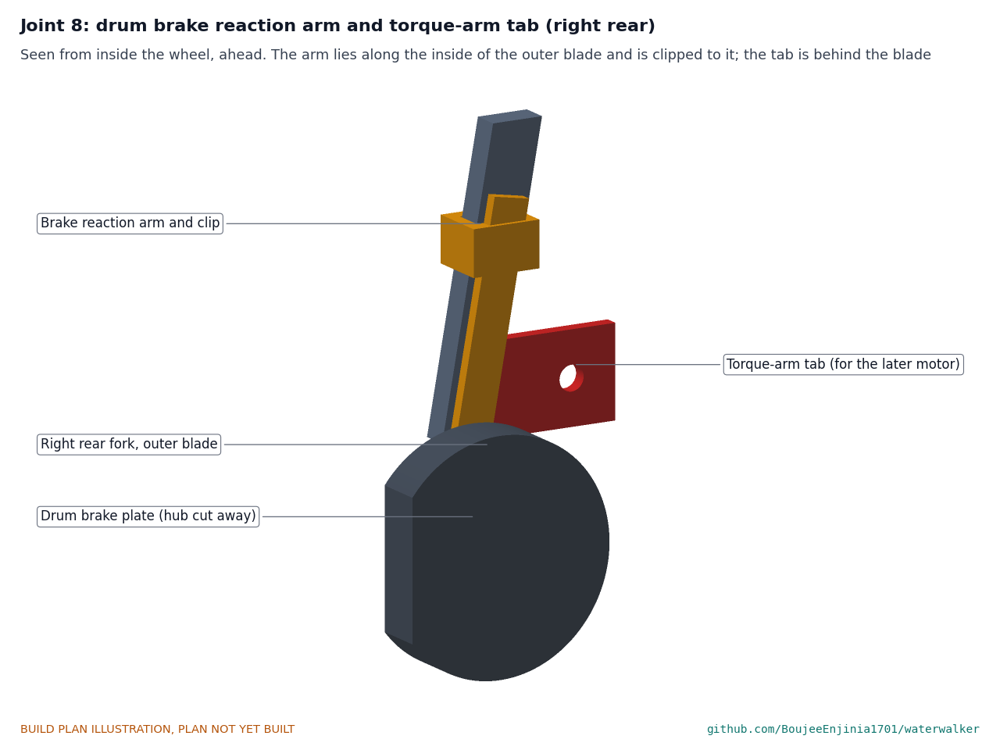

*Figure 13. Joint 8. The torque-arm tab sits behind the outer blade, clear of the drum brake's reaction arm.*

**Check before moving on.** The 10 mm bar slides through both lock pin tabs without force; no crack shows at any weld under a bright lamp.

### 3.6 Skirt guards (make 2, mirror images)

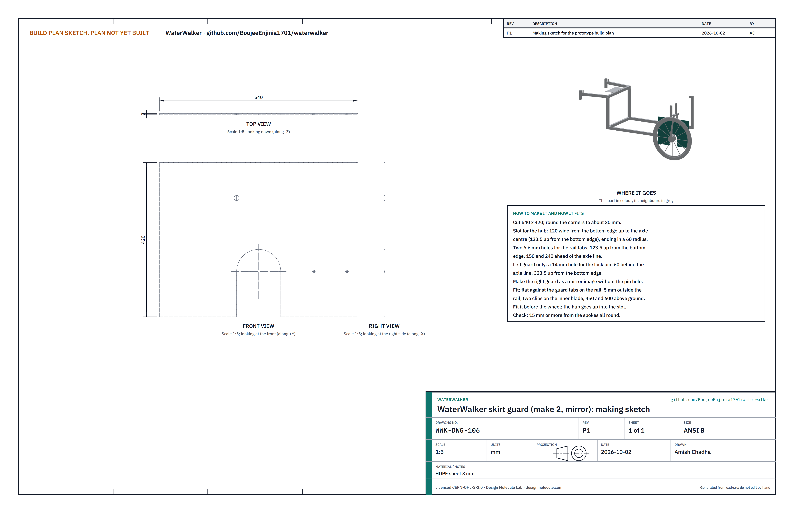

*Figure 14. Skirt guard making sketch (WWK-DWG-106).*

**What it is and what it is made from.** A plastic sheet between each rear wheel's spokes and the walking space, so skirts, wraps and hands stay out of the spokes. HDPE sheet 3 mm.

**How to make it.**

1. Cut 540 x 420; round the corners to about 20.
2. Cut the hub slot: 120 wide, from the bottom edge up to the axle centre (123.5 up), finished with a 60 radius. The axle centre is 270 from the guard's rear edge.
3. Drill two 6.6 holes 123.5 up, at 150 and 240 ahead of the axle line, for the rail tabs.
4. Left guard only: drill a 14 hole for the lock pin, 60 behind the axle line and 323.5 up from the bottom edge.

**How it fits the parts next to it.**

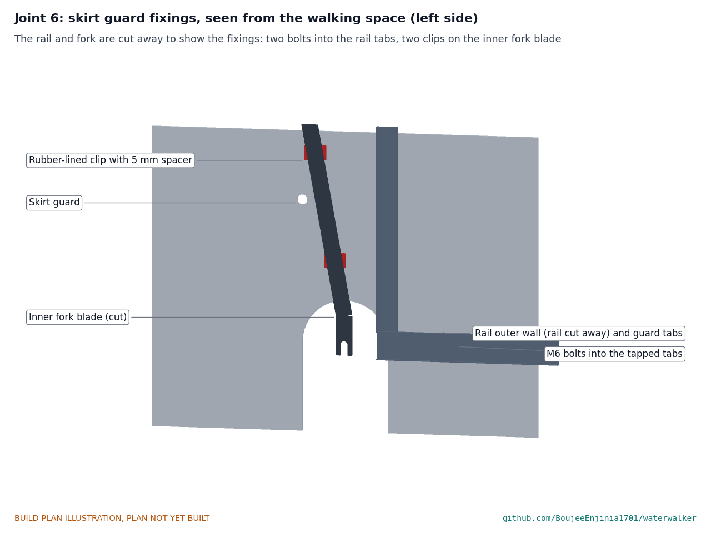

*Figure 15. Joint 6. Two M6 bolts into the tapped rail tabs; two rubber-lined clips with 5 mm spacers on the inner fork blade.*

The guard lies flat against the two tabs, 5 outside the rail, and 15 from the spokes. The clips go round the inner fork blade 450 and 600 above the ground. The guard goes on before the wheel; the hub rises into the slot.

**Check before moving on.** The guard is flat, with no cracks at the slot corners or holes.

### 3.7 Hip bar weldment

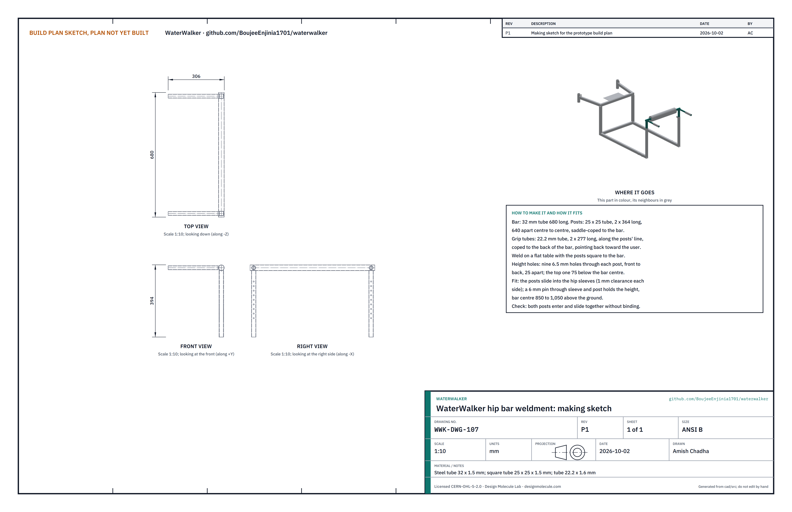

*Figure 16. Hip bar weldment making sketch (WWK-DWG-107).*

**What it is and what it is made from.** The bar the user pushes with her hips and the two grip tubes for her hands, on two posts that slide into the hip sleeves. Round tube 32 x 1.5 mm, square tube 25 x 25 x 1.5 mm and round tube 22.2 x 1.6 mm.

**How to make it.**

1. Cut the bar 680 long, the two posts 364 long and the two grip tubes 277 long.
2. Saddle-cope the top of each post to the bar. Weld the posts under the bar, 640 apart centre to centre, square to it, on a flat table.
3. Cope one end of each grip tube to the back of the bar and weld it level, in line with its post, pointing back toward the user.
4. Drill nine 6.5 holes front to back through each post, 25 apart, the top one 75 below the bar centre.

**How it fits the parts next to it.**

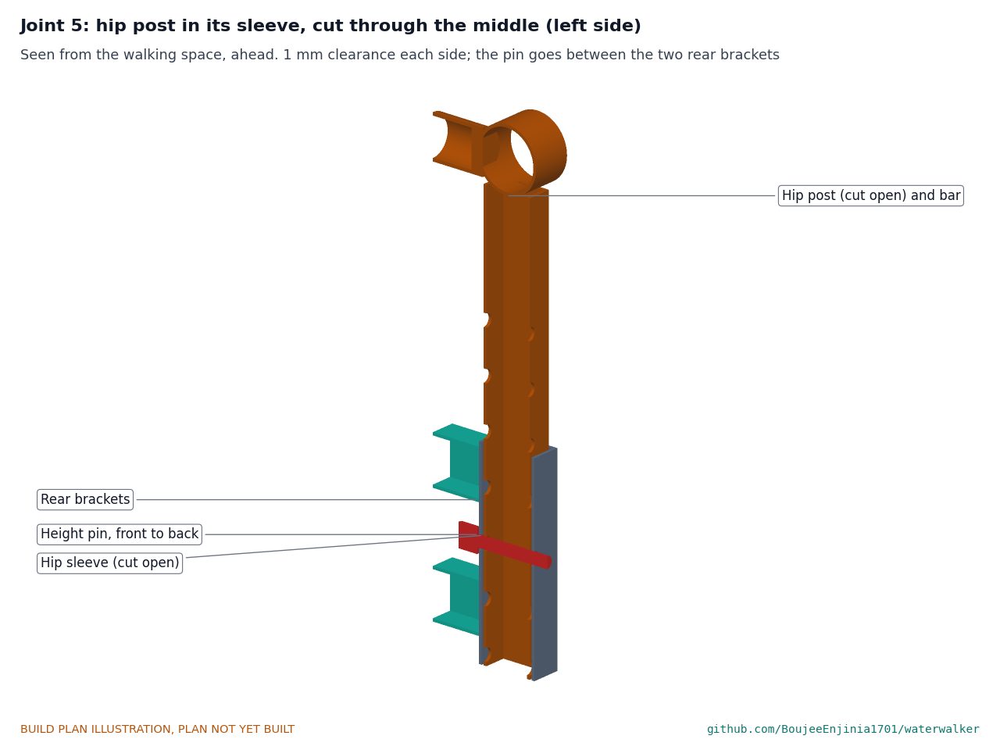

*Figure 17. Joint 5. Each post slides in its sleeve with about 1 mm clearance each side; a 6 mm pin through sleeve and post sets the height, passing between the two rear brackets.*

The pad slides over the bar; a bicycle grip goes on the rear end of each grip tube, with the brake lever ahead of the right grip. The nine holes give a bar height of 850 to 1,050 above the ground in 25 steps; at 1,050, 150 of the post stays in the sleeve.

**Check before moving on.** Both posts enter both sleeves together and slide without binding at every height.

### 3.8 Cradle

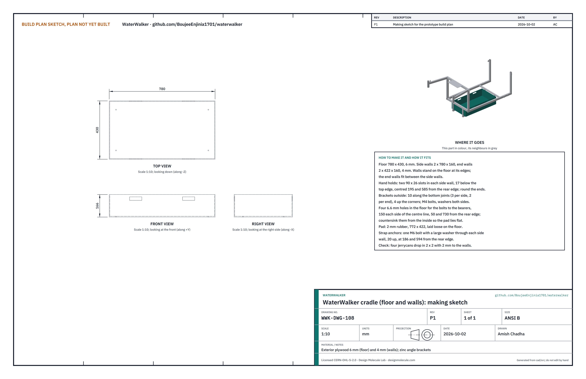

*Figure 18. Cradle making sketch (WWK-DWG-108).*

**What it is and what it is made from.** A low plywood tray that the four jerrycans stand in, with a rubber pad on its floor. Exterior plywood 6 mm (floor) and 4 mm (walls), 14 zinc angle brackets, rubber cut from used inner tubes or tires.

**How to make it.**

1. Cut the floor 780 x 430 (6 mm), two side walls 780 x 160 and two end walls 422 x 160 (4 mm).
2. Seal every edge with exterior paint or varnish and let it dry.
3. Stand the side walls on the floor's long edges, flush outside; fit the end walls between them, on the floor's short edges.
4. Hold the joints with angle brackets outside: three along each side wall's bottom, two along each end wall's bottom, one up each corner. Drill through bracket and plywood and fit M4 bolts with washers both sides.
5. Drill four 6.6 holes in the floor for the bearer bolts, 150 each side of the centre line, 50 and 730 from the rear edge; countersink them from the inside.
6. Fit the two strap anchors: an M6 bolt with a large washer through each side wall, 20 above the floor, at 186 and 594 from the rear edge, with a webbing loop under its head.
7. Cut the pad 772 x 422 and lay it loose on the floor.

**How it fits the parts next to it.**

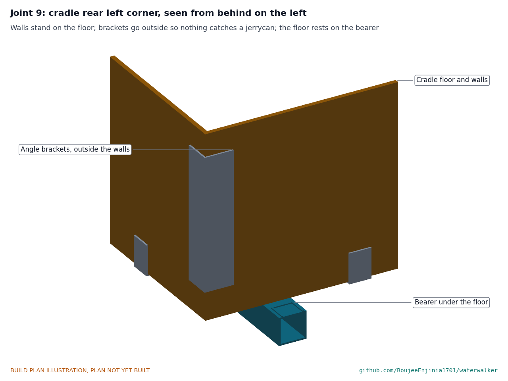

*Figure 19. Joint 9. The walls stand on the floor; brackets go outside so nothing catches a jerrycan; the floor rests on the bearer (the bolt is shown in Figure 8).*

Four M6 countersunk bolts go down through the floor and the bearers, with nyloc nuts underneath. The jerrycans stand 2 x 2 on the pad with 2 mm to each wall.

**Check before moving on.** The tray is square within 3 mm on its diagonals, and four jerrycans drop in and lift out by hand.

### 3.9 Bought components

Buy to specification, not brand. Line numbers are those of the bill of materials.

- **Rear wheels (line 2).** 26 in (559 mm bead seat) alloy rims, 36 spokes, 100 mm front-type drum-brake hubs (70 mm drum) with their reaction arm and clip. **Front wheels (line 3).** The same rims on 100 mm plain hubs.
- **Forks (lines 2 and 5).** Four rigid 26 in steel forks, 1 1/8 in steerer at least 170 mm above the crown, 100 mm dropouts, offset as near 60 mm as the market offers. All four are the same.
- **Headset and lock sets (line 16).** Four 1 1/8 in external-cup headsets for a 34 mm bore, with top caps and star nuts; four 40 mm clamp collars for 28.6 mm (made into lock collars, section 3.4); four 8 mm steel pins 75 to 90 long with a ring and an R-clip.
- **Tires (line 14).** Four 26 x 2.1 to 2.4 in puncture-resistant tires, thorn-resistant tubes and liners.
- **Brakes (line 7).** One brake lever with a parking latch for 22.2 mm bars, a cable splitter, two cables and housing.
- **Hip bar parts (line 4).** A foam pad for a 32 mm bar, 480 long; two bicycle grips; two 6 mm pins with a ring and R-clip.
- **Parking lock pin (line 15).** A 10 mm ball-lock pin with about 140 mm usable length, a pull ring and a lanyard.
- **Skirt guard clips (line 8).** Four rubber-lined steel clips for the fork blade, with 5 mm spacers and M6 bolts.
- **Fixings and finishes (line 12).** M6 and M4 bolts with nyloc nuts and washers, axle nuts, plastic tube end caps, primer and paint, red rear and white front reflectors, cable ties.

## 4. Putting it together

In each picture the parts already fitted are grey and the part being fitted is in colour, with an arrow showing the way it goes in. Paint the frame, the brackets and the carrier before step 1, and let the paint harden.

### Step 1: headset cups into the four head tubes

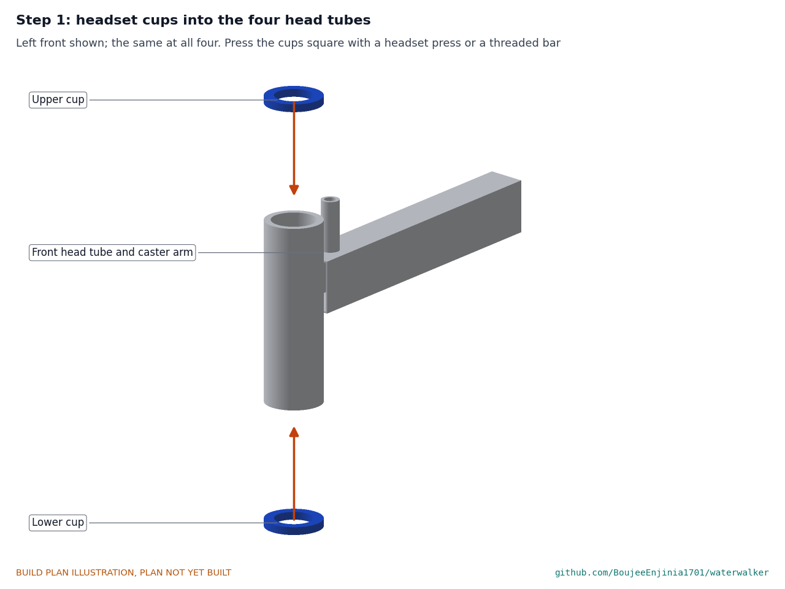

Press the lower and upper cups square into each head tube with a headset press or a threaded bar and two thick washers. The same at all four corners.

### Step 2: rear forks into the rear head tubes

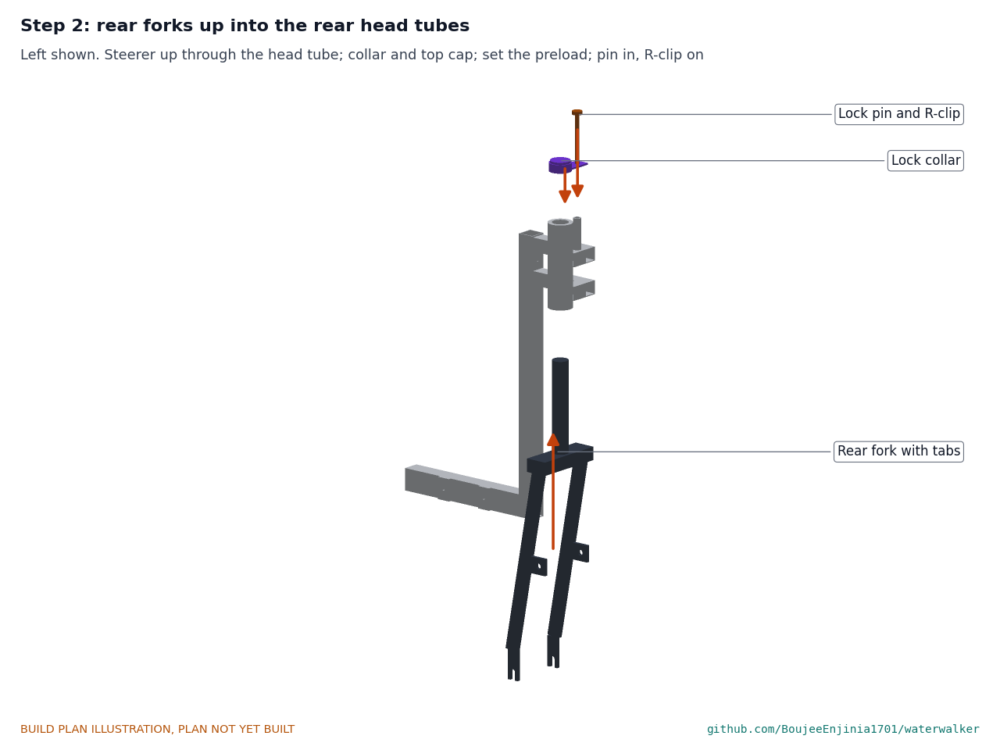

Fit the crown race, grease the bearings and push each rear fork's steerer up through its head tube, with the dropouts ahead of the steering axis. Slide on a 2 mm spacer and the lock collar, fit the star nut and top cap, and tighten the top cap until the fork turns without play. Turn the fork straight, tighten the collar bolt with its hole over the pin guide, and drop in the lock pin with its R-clip. **Hold point:** each rear fork is straight (sight the dropouts against the front head tube) and cannot turn.

### Step 3: front forks into the front head tubes

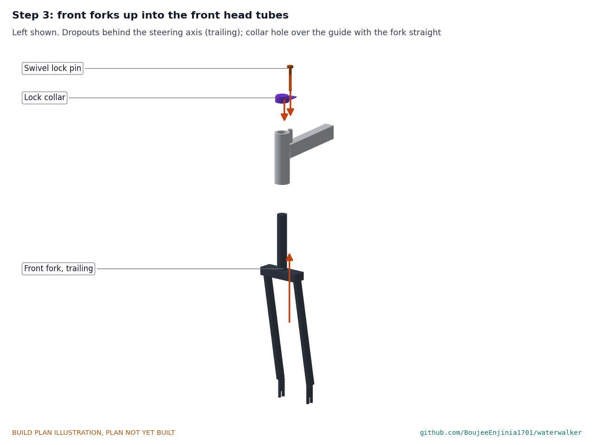

As step 2, but with the dropouts behind the steering axis so the wheel trails. Tighten the collar with its hole over the guide when the fork points straight back. The swivel lock pin drops in to lock the caster straight and lifts out to let it swivel.

### Step 4: skirt guards

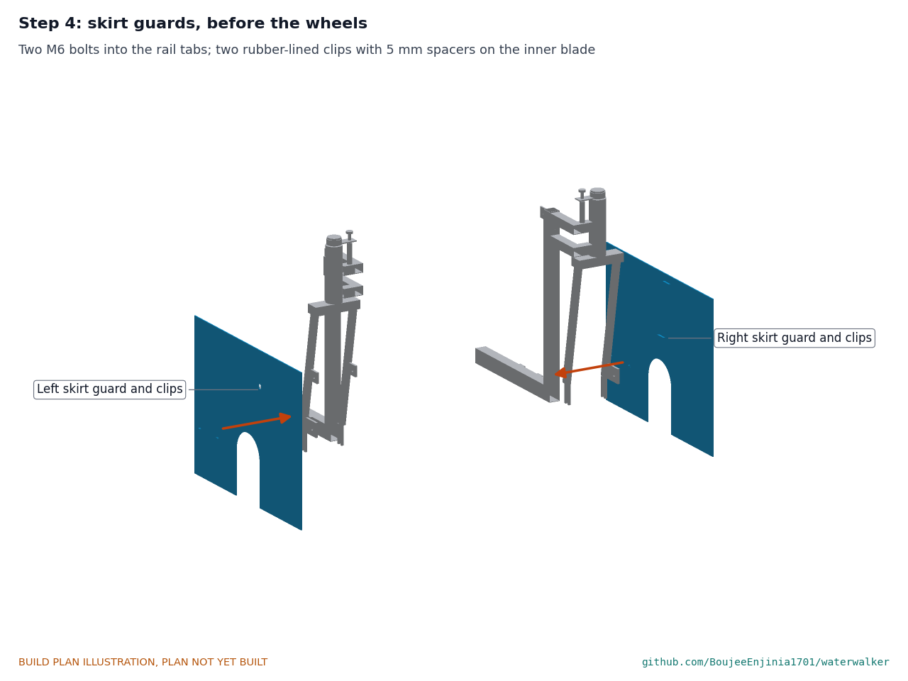

Before the wheels. Hold each guard flat against its two rail tabs, fit two M6 bolts with washers, then fit the two clips round the inner fork blade with their spacers and M6 bolts through the guard.

### Step 5: rear wheels

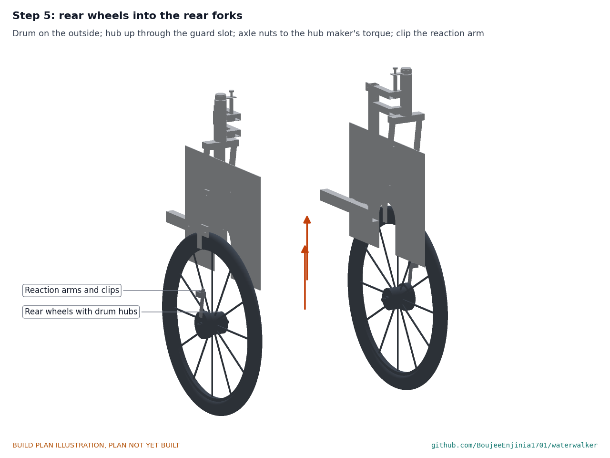

Fit the tire, liner and tube to each wheel first. Lift each rear wheel into its fork with the drum on the outside, the hub rising into the guard's slot. Fit the axle nuts to the hub maker's torque, lay the reaction arm along the outer blade and fit its clip. Spin each wheel: nothing touches.

### Step 6: front wheels

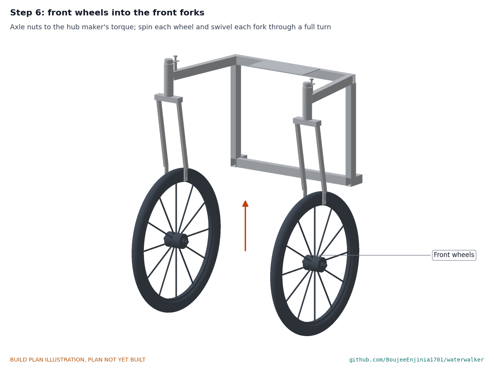

Fit tires as in step 5, then the front wheels, axle nuts to the hub maker's torque. With the lock pins out, swivel each fork through a full turn: the tire clears the riser and rail by about 20 mm.

### Step 7: hip bar

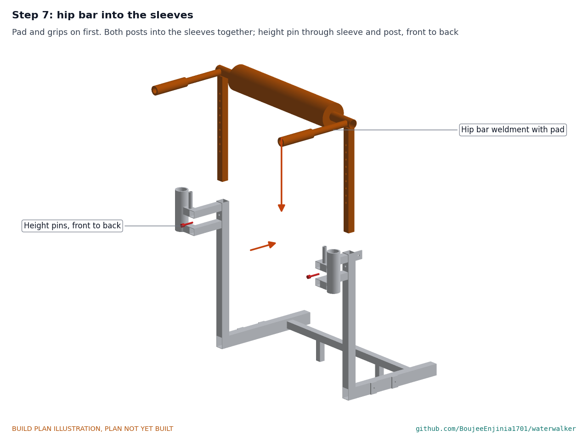

Slide the pad onto the bar and the grips onto the grip tubes (the right grip after step 8). Lower both posts into the sleeves together and fit the height pins front to back at the user's height.

### Step 8: brake lever and grip

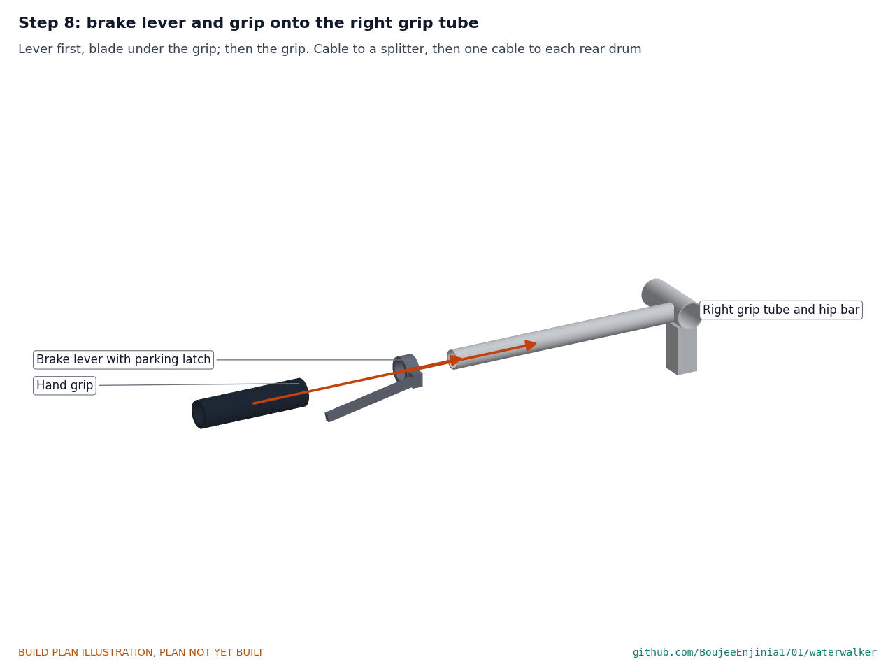

Slide the brake lever onto the right grip tube ahead of where the grip goes, then the grip. Run one cable from the lever to a splitter on the right sleeve and one cable from the splitter to each drum, along the rear brackets and down the outer fork blade, with no cable across the open rear. Adjust both drums to bite at the same lever travel.

### Step 9: cradle

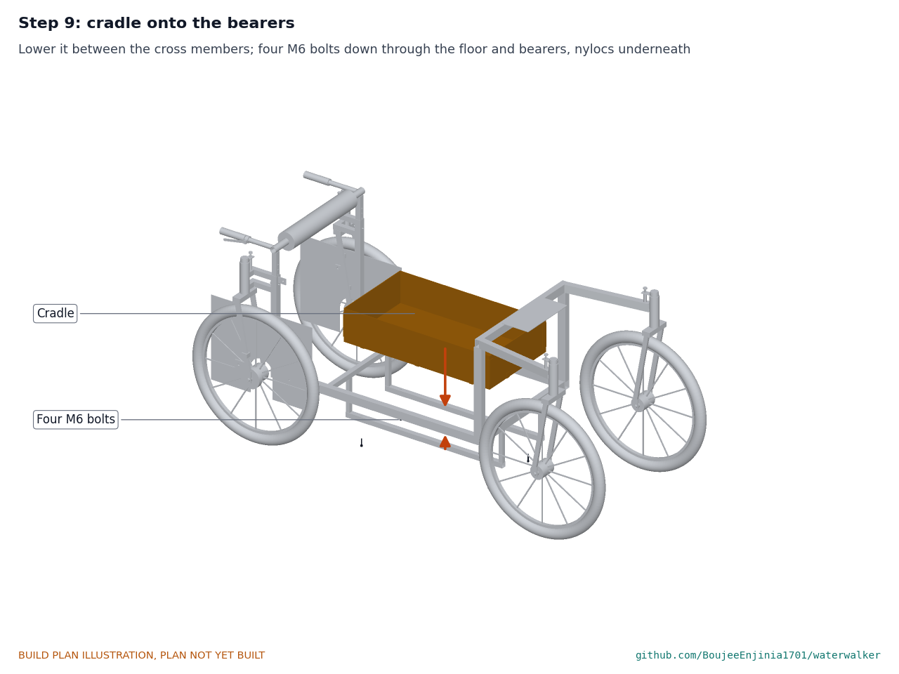

Lower the cradle between the cross members onto the bearers and fit four M6 countersunk bolts down through the floor and bearers with nyloc nuts underneath.

### Step 10: parking lock pin

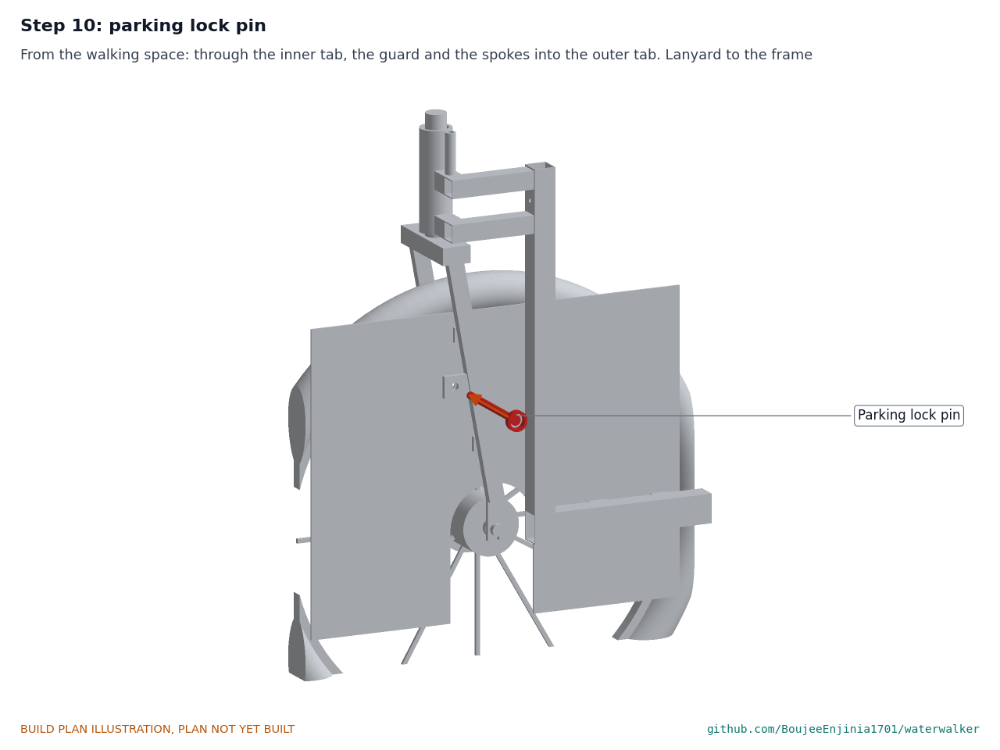

Tie the lanyard to the left sleeve. From the walking space, push the pin through the inner tab, the guard and between the spokes into the outer tab; roll the wheel a little if a spoke is in the way. It ends inside the axle nut.

### Step 11: first load

Only after safety stops S1 to S4 (section 6). Lift each jerrycan in from the side over the rail and stand them 2 x 2; strap each row down to the strap anchors.

## 5. First checks

These are the checks a TRL 4 test report would record; this plan only lists them. Requirement numbers are those of WWK-REQ-001.

*Table 3. First checks.*

| Check | Requirement | How | Pass when |
| --- | --- | --- | --- |
| Width | R6 | Tape over the axle nuts and the lock pin | 900 mm or less (898 mm by design) |
| Walk-in fit | R7 | Measure between the rails; a user walks in and sets the hip bar at 850, 950 and 1,050 | 600 mm or more clear; no step-over; the pin fits at each height |
| Caster swivel and sweep | R5 | Swivel each front fork through a full turn; lock it straight with the pin | No contact; about 20 mm to the riser; the pin drops in only when straight |
| Turning circle | R5 | Turn 180 degrees about the inner rear wheel on a flat yard, casters free | Within a 4.0 m circle without lifting a wheel |
| Lift height | R8 | Measure the rail top and lift a full jerrycan in from each side | 450 mm or less (364 mm by design) |
| Brakes | R10, R4 | Lever pull on a 10 % ramp, loaded; push the lever latch on | Both drums lock at the same travel; the latch holds the lever |
| Parking lock | R10 | Loaded on a 20 % ramp, latch off, lock pin in, facing downhill and uphill | The carrier does not move; the pin comes out by hand afterwards |
| Push force | R2, R3, R4 | Force gauge at the hip bar, loaded, on firm level dirt, loose sand and a 10 % climb | Recorded against 60, 150 and 180 N |
| Empty mass | R9 | Weigh the empty carrier | Recorded against 35 kg (39.6 kg estimated) |
| Frame after first load | R1 | Load 90 kg in the cradle for 10 minutes; check every weld and the bearers | No crack, no lasting bend; bearers level within 2 mm |

## 6. Safety stops

Stop at each point. Carry on only when everything listed is true.

- **S1. Before any load goes in the cradle.** Every weld inspected under a bright lamp, with no cracks or undercut at the caster arms, risers, rear brackets, hangers and the fork tabs. All four axle nuts at the hub maker's torque. Both rear forks pinned straight.
- **S2. Before the carrier leaves the bench.** Both drums brake at the same lever travel and the latch holds. The lock pin goes in and out by hand. No sharp edge or tube end is open; every end cap fitted.
- **S3. Before the first loaded push.** A flat, level yard with no road traffic and nobody in the swivel zone of the front wheels. Start with two jerrycans, then four. The user knows how to set the latch and the lock pin.
- **S4. Before any slope.** The parking test of section 5 passed on the ramp. A second person stands downhill. Casters pinned straight on descents and cross-slopes.
- **S5. Before anyone else uses it.** The rated load (90 kg gross in the cradle) and the steepest rated slope are marked on the frame where the user can read them.

## 7. Tools, skills and workspace

**Tools.** Angle grinder with cutting, grinding and flap discs, or a metal cutting saw; bench vice; drill press or a drill in a stand; drills 3 to 14 mm and a 9 mm drill; M6 tap; hole saw or file for tube coping (a tube notcher if available); arc or MIG welder suited to 1.2 mm wall tube; welding magnets and clamps; steel rule, tape, square, protractor and spirit level; headset press or threaded bar; crown race setting tool; bicycle tools (spoke key, cone spanners, 15 mm axle spanner, tire levers, pump, Allen keys); jigsaw or handsaw for plywood; utility knife for the rubber and HDPE; torque wrench covering about 5 to 40 N·m; luggage scale or platform scale; force gauge for the first checks.

**Skills.** A welder who can weld thin-wall tube without burning through and who has welded to steel bicycle forks; a bicycle mechanic for the headsets, wheels and brakes (or the same person with both skills); basic woodwork. No electrical work is part of this build.

**Workspace.** A flat concrete floor about 3 x 2 m to build the frame on; a ventilated welding area away from anything that burns; a ramp or slope of known grade (10 % and 20 %) for the first checks.

**Personal protective equipment.** Welding helmet, leather gloves and cotton clothing when welding; safety glasses and hearing protection when grinding; gloves when handling cut tube; no gloves near a turning drill.

## 8. Where the numbers come from

- Model and constructability checks: `cad/src/model.py` (`python cad/src/model.py --check`, 79 checks); STEP and STL exports in `cad/step/` and `cad/stl/`.
- Pictures: `cad/src/build_plan_media.py`, using `.kit/build_views.py`; written to `docs/05-build-plan/` and `cad/drawings/WWK-DWG-101` to `WWK-DWG-108`.
- General arrangement: `cad/drawings/WWK-DWG-001.pdf`, Rev P3.
- Calculations: `docs/04-calcs/01-sizing.md` (WWK-CAL-001 v0.3) and `docs/04-calcs/sizing.py`; mass section 3, frame and brackets section 7, brakes and parking section 6.
- Bill of materials: `bom/bom.csv`.
- Decisions: `docs/decisions/0003-design-for-construction.md` (WWK-DDR-003), with WWK-DDR-001 and WWK-DDR-002; open items in `docs/06-design-decisions.md` (WWK-DEC-001).
- Requirements: `docs/03-requirements.md` (WWK-REQ-001 v0.5).
